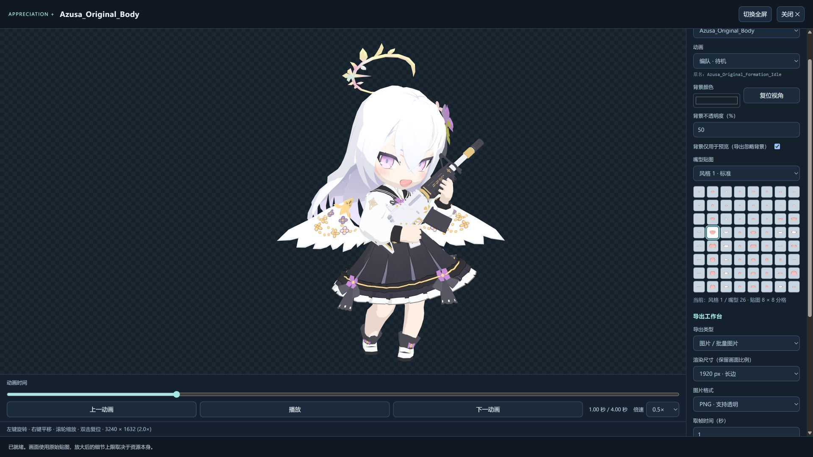

# Kivowiki-Mods-Appreciation-Plus

为 [KivoWiki](https://kivo.wiki/) 角色鉴赏页面提供独立预览、动画控制、嘴型切换和图片、视频导出。

**本模块只能在 Kivowiki-Mods 管理器中运行，不能作为独立浏览器扩展安装，也不是油猴脚本。**

- [安装 Kivowiki-Mods（Chrome 扩展商店）](https://chromewebstore.google.com/detail/kivowiki-mods/jcdbcjnphpejofgofkjhnkpgmfeidlec)
- [Kivowiki-Mods 管理器 GitHub 仓库](https://github.com/AsaMisogi/Kivowiki-Mods-Core)

## 功能

- **独立鉴赏窗口**：支持立绘、回忆大厅、人物模型和光环模型，可切换浏览器全屏。原站播放器和导出入口仍可正常使用。
- **动画播放**：拖动时间条定位，暂停、继续播放，调整 0.1×–4× 倍速。动画列表按已知命名规则显示中文，下方保留原名；未知名称保留原文。
- **画面操作**：Spine 支持缩放和平移，3D 模型支持旋转、平移和缩放。回忆大厅可选择完整显示或填充为 16:9。
- **嘴型预览**：支持嘴部材质的角色模型可从四套图集中点选嘴型，缩略图对应实际使用的图格。
- **图片导出**：导出 PNG / JPG，立绘可框选裁剪；支持 Spine 原始尺寸和多档分辨率，可将多个动画的取帧图片打包为 ZIP。
- **视频导出**：支持 MOV、MP4、WebM、MKV，以及 24 / 30 / 60 fps。可按当前动画导出，也可将当前资源的全部主动画分别导出后打包。
- **背景设置**：可设置背景颜色与不透明度，并选择背景仅用于预览，或同时用于导出。

## 安装与更新

需要 Kivowiki-Mods **1.6.1–1.x**（已验证 1.6.3）、启用管理器内置的 `core-runtime` 依赖，以及支持 User Scripts 的 Chromium 浏览器。模块使用 `page` 模式，请按管理器提示开启浏览器的“允许用户脚本”；严格沙箱模式无法运行本模块。

1. 安装并启用上方链接中的 Kivowiki-Mods 管理器。
2. 打开管理器配置中心，在 Git 仓库导入入口粘贴本仓库地址：

   ```text
   https://github.com/AsaMisogi/Kivowiki-Mods-Appreciation-Plus
   ```

3. 确认导入并启用模块。若提示依赖未启用，请启用 `core-runtime`。
4. 刷新角色页面，进入“鉴赏”，点击对应区域标题旁的“沉浸鉴赏”按钮。

也可以在 GitHub 点击 **Code → Download ZIP**，将下载的仓库 ZIP 导入管理器。本仓库已包含运行所需的构建产物，使用者无需安装 Node.js 或自行编译。更新时重新导入同一仓库，按管理器提示升级即可。

仓库公开并被 GitHub 收录后，可在管理器的 Git 市场中搜索 `Appreciation`。如暂未出现在列表中，使用上面的仓库地址导入。

## 使用示例

人物模型预览：右侧选择动画和嘴型，下方控制动画时间与倍速。



### 播放与取帧

拖动时间条后会暂停，便于观察细节，并将当前位置同步到图片的“取帧时间”。切换动画会回到起点，保留当前播放或暂停状态。

时间条获得焦点后，方向键每次移动 1/60 秒，PageUp / PageDown 移动 1 秒，Home / End 跳到起点或末帧。没有动画的模型和零时长姿态没有可拖动的时间轴。

倍速只影响预览。视频始终按动画原速及所选帧率导出；图片按“取帧时间”导出。直接暂停播放后若要导出这一帧，可点击“使用当前画面时间”。

### 图片与视频

- PNG 支持透明背景，JPG 的透明区域铺白。默认的“背景仅用于预览”不会把预览背景加进导出文件。
- 视频无声且不保留透明通道，从动画起点开始，按指定时长循环；人物模型保留当前观察视角。
- 回忆大厅的“填充”沿用站内 16:9 构图，以骨骼原点定位，不受背景偏边影响，也不拉伸画面；导出不含预览窗口留白。视频不使用立绘的图片裁剪选区。
- “一键导出全部”只处理当前资源中的主动画，不会跨角色下载其他资源。
- 导出可取消。浏览器拦截自动下载时，可点击窗口底部保留的下载链接。

## 使用限制与数据处理

画面细节取决于原始贴图，放大或提高导出分辨率不会补出原资源没有的细节。支持的资源格式为 Spine 4.2、GLB / GLTF 和 OBJ；部分原模型本身可能存在显示问题。

视频单次时长为 0.1–120 秒。高分辨率或较长视频会占用更多内存，遇到资源限制时请降低分辨率、帧率或时长。最长边 3840 像素不代表所有设备都能导出长时间 4K 视频。

模块通过管理器读取公开角色资源，在浏览器本地渲染和转码，不上传导出内容，也不读取账号信息。随包包含本地转码器，因此安装包约 15 MB；首次视频导出需要加载转码器。

## 开发

```sh
npm ci
npm run check
```

源码位于 `src/`，管理器入口位于 `dist/`，随包资源位于 `assets/`。构建命令同时生成 `release/` 下的可导入 ZIP；开发依赖、研究样本和测试输出不提交到仓库。

Core 集成检查需要本地 Core 源码，可通过 `KIVOWIKI_CORE_DIR` 指定路径；在当前多项目工作目录中也会自动使用相邻的 `Kivowiki-Mods-Core`。独立克隆且未提供 Core 时，这些集成检查会明确标为跳过，其余测试正常运行。

技术细节与验证记录见 [工程说明](docs/ENGINEERING.md)。第三方软件和角色资源的许可、来源见 [第三方说明](THIRD_PARTY_NOTICES.md) 与 `licenses/`；本模块不改变这些资源的权利归属。
